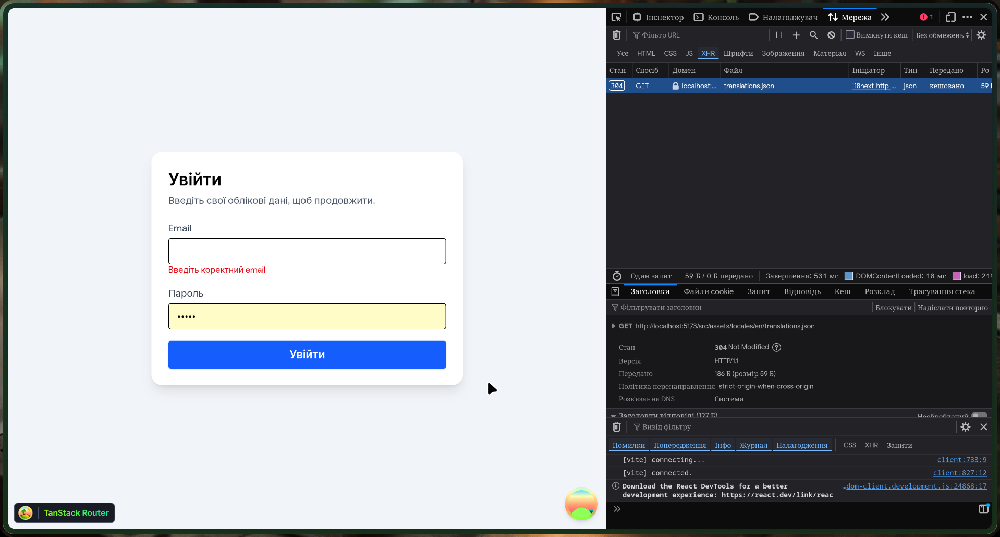
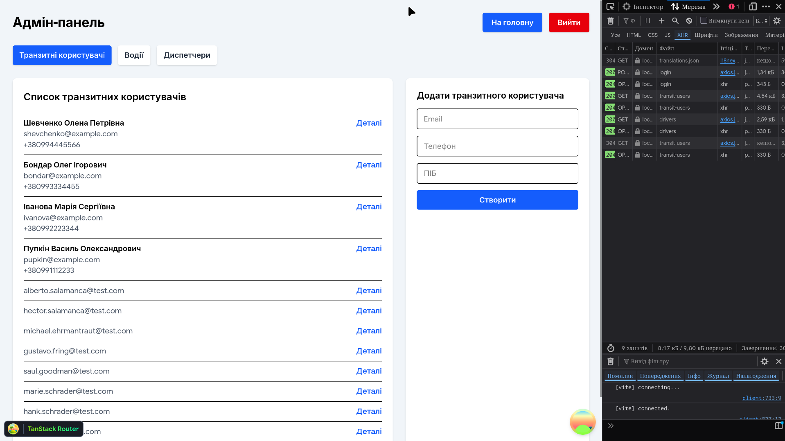
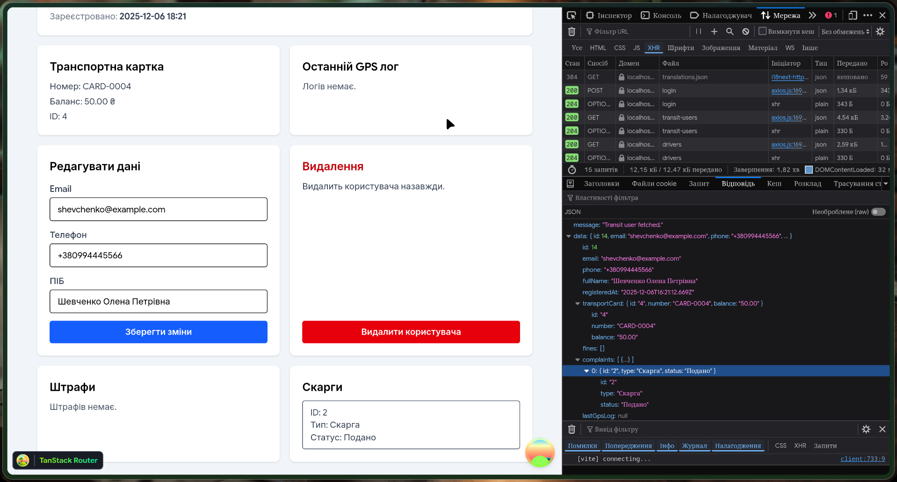

# Лабораторна робота №8-9 (frontend)

## Опис реалізованого функціоналу
- Налаштовано клієнт до REST API (`VITE_API_BASE_URL` з `/v1`), Axios з інтерцепторами підхоплює JWT із Zustand або `.env`.
- Автентифікація: сторінка логіну на React Hook Form + Zod, збереження токена у Zustand; реєстрація транзитного користувача також на RHF+Zod.
- Адмін-панель: вкладки для транзитних користувачів, водіїв і диспетчерів з формами створення (RHF+Zod) та сторінками деталей з оновленням/видаленням через TanStack Query мутації.
- CRUD для поповнень карток: список, створення, перегляд, оновлення суми й видалення, усі форми валідовані Zod.
- Кабінет транзитного користувача: перегляд своєї картки та поповнень; захист доступу за роллю.

## Ключові фрагменти коду
- Axios з інтерцепторами (`src/lib/axios.ts`)
  ```ts
  const apiClient = axios.create({ baseURL: import.meta.env.VITE_API_BASE_URL });
  apiClient.interceptors.request.use((config) => {
    const token = getStoredToken() ?? import.meta.env.VITE_API_AUTH_TOKEN;
    if (token) {
      config.headers = config.headers ?? {};
      config.headers.Authorization = token.startsWith("Bearer") ? token : `Bearer ${token}`;
    }
    return config;
  });
  ```
- Приклад хуків TanStack Query (`src/features/transitUsers/api.ts`)
  ```ts
  const getAll = async () => (await apiClient.get<ApiSuccess<TransitUser[]>>(baseUrl)).data.data;
  export const useTransitUsers = () => useQuery({ queryKey: baseKey, queryFn: getAll });
  export const useUpdateTransitUser = () =>
    useMutation({
      mutationFn: updateItem,
      onSuccess: async (updated) => {
        await queryClient.invalidateQueries({ queryKey: baseKey });
        queryClient.setQueryData([...baseKey, updated.id.toString()], updated);
      },
    });
  ```
- Приклад схеми Zod + React Hook Form (логін, `src/features/auth/pages/LoginPage.tsx`)
  ```ts
  const loginSchema = z.object({
    email: z.string().email("Введіть коректний email"),
    password: z.string().min(6, "Мінімум 6 символів"),
  });
  const { register, handleSubmit, formState: { errors } } =
    useForm<LoginForm>({ resolver: zodResolver(loginSchema) });
  ```

## Налаштування та запуск
1. Створіть `.env` на основі `.env.example`, задайте `VITE_API_BASE_URL="http://localhost:4000/v1"` і токен `VITE_API_AUTH_TOKEN` (або залогіньтеся через UI).
2. Запустіть бекенд (див. `/home/kirito/WebstormProjects/workshop-5`, стартує на `:4000` з префіксом `/v1`).
3. У фронтенді: `pnpm install`, потім `pnpm dev`.

## Скриншоти (підготуйте для звіту)



## Коментарі
- Бекенд уже на префіксі `/v1`, тому у фронтенді база API містить `/v1`, а всі шляхи у хуках задані без цього префікса, щоб уникнути дублювання `/v1/v1`.
- CRUD для ключових сутностей реалізовано через TanStack Query, усі нові форми працюють через RHF+Zod і показують помилки валідації.
